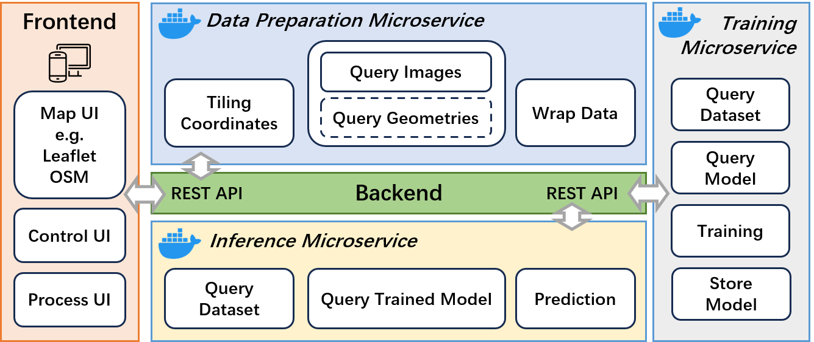

# OSM Building Detection Server

GeoAI as a Service


## Creating Python Virtual Environments

```shell
python -m venv venv
myvenv/Scripts/activate.bat
# or
myvenv/Scripts/activate.ps1
```

**Note: If conda environment is active, deactivate it firstly via `conda deactivate`.**git